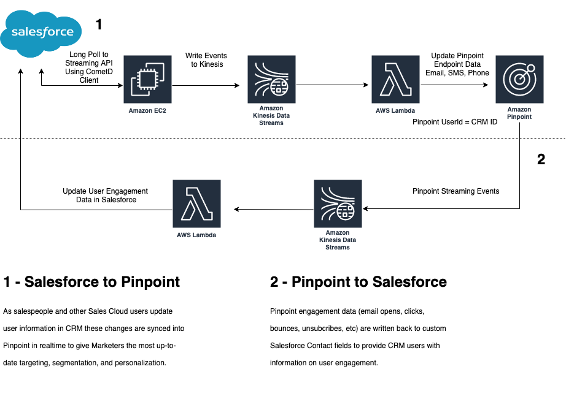
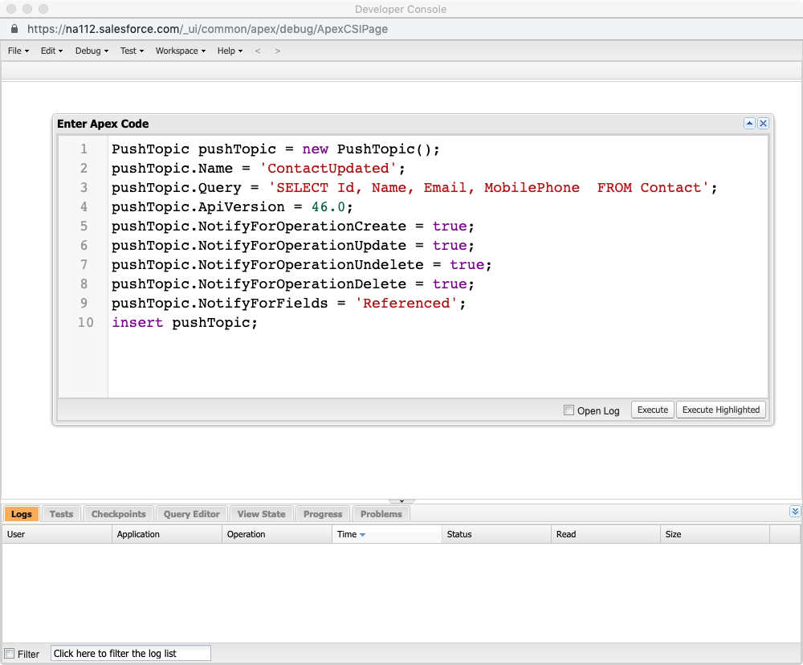
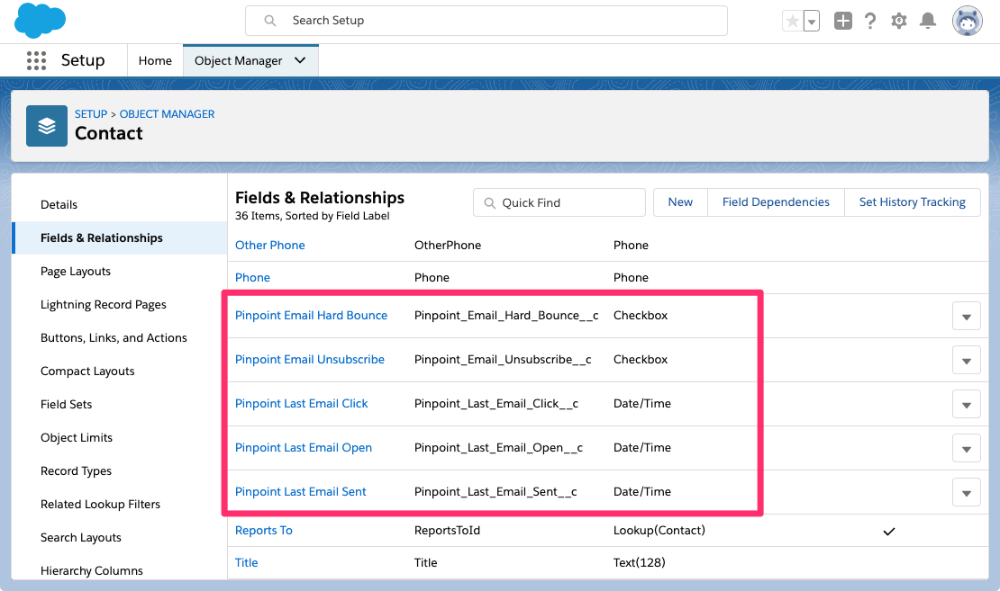

## Amazon Pinpoint Salesforce Connector Demo

Drive richer segmentation, targeting, and personalization with Amazon Pinpoint by creating a realtime sync to Salesforce CRM.  Additionally, sync Pinpoint Engagement event data back to Salesforce CRM in realtime to enable Sales Cloud users the ability to see which Contacts are engaged.

## Use Case

As a marketer, you want to ensure that your email, phone, and SMS contact information stays up to date with your Salesforce CRM instance where the rest of your organization manages this data.  If a customer's email address changes, as an example, you need to know in real time to ensure high deliverability and engagement through your marketing campaigns.  Additionally, as new CRM Contacts are added, you want the ability to incorporate them into nurture campaigns immediately without manual uploading of files.

As a Salesforce CRM user, you want to see engagement data for each customer on the CRM Contact record.  This provides you with a better understanding of how the customer is engaging with your brand and helps to avoid contact fatigue across multiple channels.  

Keeping your Marketing and Sales data in sync with each other allows both organizations to get insight into the 360 degree view of the customer.

## Architecture

## Prerequisites

You need the following:

* A Salesforce Sales Cloud Organization
   * [Streaming API](https://developer.salesforce.com/docs/atlas.en-us.api_streaming.meta/api_streaming/intro_stream.htm) enabled
   * [Developer Console](https://help.salesforce.com/articleView?id=code_dev_console.htm&type=5) access
   * User permissions to add Custom Fields to the Contact Object
* A computer with node and npm installed.

* An AWS account with sufficient permissions to create the resources shown in the diagram in the earlier section. For more information about creating an AWS account, see [How do I create and activate a new Amazon Web Services account?](https://aws.amazon.com/premiumsupport/knowledge-center/create-and-activate-aws-account/).
* An Amazon EC2 key pair. You need this to log into the EC2 instance if you want to modify the Twitter handle that you're monitoring. For more information, see [Creating a Key Pair Using Amazon EC2](https://docs.aws.amazon.com/AWSEC2/latest/UserGuide/ec2-key-pairs.html#having-ec2-create-your-key-pair).
* The AWS Command Line Interface (AWS CLI) installed and configured on your macOS-based computer. For information about installing the AWS CLI, see [Installing the AWS Command Line Interface](https://docs.aws.amazon.com/cli/latest/userguide/installing.html). For information about setting up the AWS CLI, see [Configuring the AWS CLI](https://docs.aws.amazon.com/cli/latest/userguide/cli-chap-getting-started.html).

### Setup
#### Step 1: Create a PushTopic for the Salesforce Streaming API

The first step is to setup the target Salesforce CRM organization to start streaming Contact events.  The following steps use the Salesforce Developer Console to execute Apex code.

1. Log into your Salesforce instance and open the Developer Console
2. Click **Debug | Open Execute Anonymous Window**
3. In the Enter Apex Code window, paste the following Apex code, and click **Execute**
``PushTopic pushTopic = new PushTopic();
pushTopic.Name = 'ContactUpdates';
pushTopic.Query = 'SELECT Id, Name, Email, MobilePhone, Birthdate FROM Contact';
pushTopic.ApiVersion = 46.0;
pushTopic.NotifyForOperationCreate = true;
pushTopic.NotifyForOperationUpdate = true;
pushTopic.NotifyForOperationUndelete = true;
pushTopic.NotifyForOperationDelete = true;
pushTopic.NotifyForFields = 'Referenced';
insert pushTopic;``

#### Step 2: Modify the Salesforce CRM Contact Object with Custom Fields

1. Log into your Salesforce instance and access **Setup | Object Manager**
2. Select the Contact object in the list of Objects
3. Select **Fields & Relationships** from the left menu
4. For each field below, follow these steps to create a custom field
    1. Click **New**
    2. Select the Field's Data type and Select **Next**
    3. Minimally provide the **Field Label** and **Field Name** and Select **Next**
    4. Select which Profiles will be able to see the field.  *Recommendation - Check the **Read-Only** header to ensure only the API can modify the values.*  Select **Next**
    5. Select which page layouts will display the new field and Select **Save**

**Fields**

| Field Label | Field Name | Datatype |
| ----------- | ---------- | -------- |
| Pinpoint Last Email Open | Pinpoint_Last_Email_Open | Date/Time |
| Pinpoint Last Email Sent | Pinpoint_Last_Email_Sent | Date/Time |
| Pinpoint Last Email Click | 	Pinpoint_Last_Email_Click | Date/Time |
| Pinpoint Email Unsubscribe | Pinpoint_Email_Unsubscribe | Checkbox |
| Pinpoint Email Hard Bounce | Pinpoint_Email_Hard_Bounce | Checkbox |

When finished, it should look similar to this:  
*NOTE - Salesforce adds "__c" to designate Custom Fields*

#### Step 3: Prepare the AWS Lambda Zip Functions

The AWS Lambda functions utilize the [JSforce](https://jsforce.github.io/) JavaScript Library to connect to Salesforce to read the Streaming API and make Contact Object updates.  This dependency requires us to deploy our AWS Lambda functions in a packaged zip.  Fully functional zip packages are already provided, but need to be deployed into Amazon S3 in order for the CloudFormation template to run properly.

To upload the zip deployment packages:

1. Sign in to the AWS Management Console, and then open the Amazon S3 console at https://s3.console.aws.amazon.com/s3/home.
2. Choose **Create bucket** to create a new AWS Lambda deployment container bucket.
3. Give the bucket a globally unique name and then click **Create**.
4. Select the newly created bucket to open it up.
5. Drag the two AWS Lambda Zip packages from the Git repo code to Amazon S3 to upload them to the bucket.
  1. salesforce-crm-update-pinpoint.zip located in the */lambdas/salesforce-crm-update-pinpoint/* folder.
  2. pinpoint-engagement-update-salesforce.zip located in the */lambdas/pinpoint-engagement-update-salesforce/* folder.
6. Ensure to note the Amazon S3 bucket name and the Amazon S3 keys for both Zip files as they will be needed in the next step to configure the AWS CloudFormation Template.

#### Step 4: Launch the AWS CloudFormation template

Now we can launch the AWS CloudFormation template that sets up the backend components that power this solution.  The AWS CloudFormation Template **salesforcedemo.template.yaml** can be found in the **cloudformation** folder of this git repostiory.

To launch the AWS CloudFormation template:

1. Sign in to the AWS Management Console, and then open the AWS CloudFormation console at https://console.aws.amazon.com/cloudformation/home.
2. Choose **Create stack**.
3. Next to **Specify template**, choose **Upload a template file**, and then choose **Choose file** to upload the **salesforcedemo.template.yaml** template file. Choose **Next**.
4. Under **Specify stack details**, for **Stack Name**, type a name for the CloudFormation stack.
5. Under **Parameters**, do the following:
    1. For **SalesforceUsername**, type your Salesforce API User username.
    2. For **SalesforcePassword**, type your Salesforce API User password.
    3. For **KeyName**, type the Amazon EC2 Key Pair key name of an existing key pair.
    4. For **S3DeploymentBucket**, type Amazon S3 deployment bucket created in Step 3.
    5. For **S3KeyLambda1**, type the Amazon S3 key for salesforce-crm-update-pinpoint.zip.
    6. For **S3KeyLambda2**, type the Amazon S3 key for pinpoint-engagement-update-salesforce.zip.
6. Choose **Next**.
7. On the next page, review your settings, and then choose **Next** again. On the final page, select the box to indicate that you understand that AWS CloudFormation will create IAM resources, and then choose **Create**.

When you choose **Create**, AWS CloudFormation creates the all of the backend components for the application. These include a Pinpoint Application, an EC2 instance, two Kinesis data streams, a Kinesis Firehose delivery stream, an S3 bucket, and two Lambda functions. This process takes about 10 minutes to complete.

#### Step 5. Test the Salesforce CRM to Amazon Pinpoint Endpoint Connection

#### Step 6. Test the Amazon Pinpoint Engagement Update to Salesforce CRM

#### Step 7. Take it to the next level - Create a Happy Birthday Email Campaign

Now that we are syncing Contact data from Salesforce CRM to Amazon Pinpoint, we can use this data to power all kinds of marketing campaigns. A very simple campaign we will setup now is a Happy Birthday email campaign using the Birthdate field in Salesforce CRM.  We will launch a Daily recurring Pinpoint Campaign that will utilize an AWS Lambda function to filter down our Endpoints to find only those with Today as their Birthday using a Pinpoint Campaign Server Extension.  All of these components have been packaged into the AWS CloudFormation template **birthdaycampaign.template.yaml** file found in the **cloudformation** folder of this git repository.

To launch the AWS CloudFormation template:

1. Sign in to the AWS Management Console, and then open the AWS CloudFormation console at https://console.aws.amazon.com/cloudformation/home.
2. Choose **Create stack**.
3. Next to **Specify template**, choose **Upload a template file**, and then choose **Choose file** to upload the **birthdaycampaign.template.yaml** template file. Choose **Next**.
4. Under **Specify stack details**, for **Stack Name**, type a name for the CloudFormation stack.
5. Under **Parameters**, do the following:
    1. For **ApplicationId**, type your Pinpoint Application Id that was created in Step 4 to resuse the same Pinpoint Application.
    2. For **CampaignEndTime**, type the Date and Time that you would like this Campaign to end in UTC. Ex: 2025-07-20T15:53:00
    3. For **CampaignStartTime**, type the Date and Time that you would like this Campaign to start in UTC. Ex: 2025-07-20T15:53:00
6. Choose **Next**.
7. On the next page, review your settings, and then choose **Next** again. On the final page, select the box to indicate that you understand that AWS CloudFormation will create IAM resources, and then choose **Create**.

When you choose **Create**, AWS CloudFormation creates the all of the backend components for the application. These include a Pinpoint Segment of ALL Endpoints, a Pinpoint Campaign that will run Daily, and two Lambda functions. This process takes about 5 minutes to complete.

## OLD INFO BELOW ##
#### Step 6: Create an Amazon Pinpoint campaign

~~In the real world, you probably don't want to send messages to users immediately after they send tweets to your Twitter handle—if you did, you might seem too aggressive, and your customers might hesitate to engage with your brand in the future.~~

Fortunately, you can use the campaign scheduling tools in Amazon Pinpoint to create a recurring campaign. When you create a recurring campaign, Amazon Pinpoint sends messages only to customers who meet certain criteria at campaign execution. Additionally, you can schedule your messages to be sent at a specific time in each recipient's time zone.

*Important*: You have to obtain consent from your customers before you send messages to them.

1. Log in to the AWS console, and then open the Amazon Pinpoint console at https://console.aws.amazon.com/pinpoint/home/?region=us-east-1.
2. On the **Projects** page, choose the app **Salesforce Pinpoint Demo Application** that was automatically created from AWS CloudFormation.
3. In the navigation pane, choose **Campaigns**, and then choose **Create a campaign**.
4. For **Campaign name**, type a name for the campaign, and then choose **Next**.
5. On the **Segment** page, do the following
    1. Choose **Create a segment**.
    2. For **Name your segment to reuse it later**, type a name for the segment.
    3. In the **Add a filter** dropdown, select **Filter by endpoint**.
    4. In the **Choose an endpoint attribute** choose
    4. For **Filter by user attributes**, choose the plus sign (+) icon. Filter by segment to ~~include all endpoints where *Sentiment* is *Positive*~~, as shown in the following image:
    
    5. Choose **Next step**.

6. On the **Message** page, type the message that you want to send, and then choose **Next step**. To learn more about writing mobile push messages, see [Writing a Mobile Push Message](https://docs.aws.amazon.com/pinpoint/latest/userguide/campaigns-message.html#campaigns-message-mobile) in the Amazon Pinpoint User Guide.
7. On the **Schedule** page, choose the date and time when the message will be sent. You can also schedule the campaign to run on a recurring basis, such as every week. To learn more about scheduling campaigns, see [Set the Campaign Schedule](https://docs.aws.amazon.com/pinpoint/latest/userguide/campaigns-schedule.html) in the Amazon Pinpoint User Guide.~~

## Troubleshooting
1. Push notifications aren't sending.
    * Did you allow permissions for push notifications on the first app launch?
    * Did the Kinesis producer script crash? Log into EC2 instance and view logs to troubleshoot.
    * Sometimes, the Twitter Stream API decides not to monitor certain Twitter accounts. Twitter does not publish their criteria for which accounts are unmonitored and why. Create a new Twitter account and its tweets should show up on the stream.
    * Did you have poor connectivity when you launched the app for the first time? Try force backgrounding/force quitting the app and restarting a few times.
    * If all else fails, consult Apple's push notification troubleshooting guide [here](https://developer.apple.com/library/content/technotes/tn2265/_index.html).
2. I'm getting more than one push!
    * This can happen if the Lambda fails unexpectedly. Exceptions should be handled apppropriately but troubleshooting for this can be done within provided Lambda funciton.

## License Summary

This sample code is made available under a modified MIT license. See the LICENSE file.
